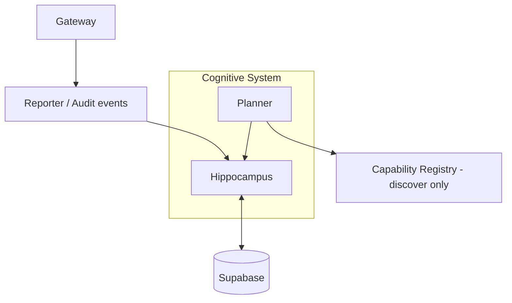

# LUNA Cognitive System

> A identidade da LUNA é preservada pela continuidade do conhecimento. A arquitetura deve evoluir por refinamento, nunca por substituição desnecessária. Um passo para trás, às vezes, é um passo na direção certa.

This principle governs every decision in this document: the Hippocampus never deletes, the Cognitive Filter never discards without reason, and the Planner never proposes a plan the organism cannot trace back to a checkpoint.

## Scope

This is version 1 of LUNA's Cognitive System: **infrastructure, not intelligence**. It adds two organs - the Hippocampus and the Planner - on top of the existing Gateway, Registry, Capability Packs, Reporter, ProviderRouter, and Context Sync, without modifying any of them. No heuristics, no LLM calls, and no "smart" decisions live here. Every decision this system makes is deterministic and traceable, so that real cognition can be layered on top of it later without having to re-architect the seams it depends on.



The Gateway remains exclusively responsible for execution. The Cognitive System only thinks, organizes knowledge, and produces plans.

## Hippocampus (`src/luna/hippocampus`)

The Hippocampus is the memory guardian of the organism: the only component allowed to persist cognitive memory. No other organ writes to Supabase for cognitive data.

### The Cognitive Filter

```
K(t) = f(L, C, I, T)
```

| Symbol | Name | Meaning |
| --- | --- | --- |
| `L` | Estado Latente | the candidate information itself (`LatentState`) |
| `C` | Contexto | where the candidate came from (`CognitiveContextSignal`) |
| `I` | Indice Cognitivo | what the organism already knows (`CognitiveIndexSnapshot`) |
| `T` | Temporalidade | whether this is new knowledge or an evolution of existing knowledge |

`applyCognitiveFilter` (`cognitive-filter.ts`) evaluates these four inputs and returns one of six decisions:

1. **discard** - below the declared salience threshold, or structurally invalid (e.g. an anonymous "semantic" candidate, or a relation between unknown concepts).
2. **create_concept** - a new semantic/procedural key, or any episodic entry.
3. **update_concept** - the key is already indexed, or temporality explicitly declares an evolution.
4. **update_relations** - a relation between two concepts already present in the index.
5. **update_checkpoint** - a checkpoint signal.
6. **reconstruct_memory** - a reconstruction request.

The filter makes no judgement about *meaning*. It routes on explicit, declared signals only - that is the deliberate boundary between infrastructure and cognition.

### Memory model

| Memory | Storage | Notes |
| --- | --- | --- |
| Episodic | `memoria_luna` (existing table, reused as-is) | Chronological, append-only. The raw substrate. |
| Semantic | `luna_cognitive_concepts` (new) | Concepts with `memoryType: "semantic"`. |
| Procedural | `luna_cognitive_concepts` (new) | Same table, `memoryType: "procedural"`. |
| Cognitive Map | `luna_cognitive_relations` (new) | Directed edges between concept keys. |
| Checkpoint | `luna_cognitive_checkpoints` (new) | Snapshot of the cognitive index at a point in continuity. |

Three new tables were added, and only because `memoria_luna`'s flat shape cannot represent a versioned concept graph. Everything else reuses what already existed. See `src/luna/hippocampus/schema.sql` for the reference schema (this repository manages its Supabase schema outside of migrations, same as `memoria_luna` already does - this file documents the contract, it is not run automatically).

### Cognitive Index and Cognitive Map

The **Cognitive Index** (`cognitive-index.ts`) is a semantic projection over the concept store: key -> current concept id, version, and state. It represents concepts, and only concepts - never files, documents, or commits.

The **Cognitive Map** (`cognitive-map.ts`) holds the relations between concepts and supports bounded breadth-first traversal (`neighborsOf(key, depth)`), which reconstruction uses to pull in concepts related to - but not literally named in - the objective.

### Temporality

Concepts evolve, they are never deleted:

```
v1 -> v2 -> v3 -> ACTIVE
                -> DEPRECATED
                -> SUPERSEDED
```

`evolveConcept` (`temporality.ts`) always produces two records: the new `ACTIVE` version and the previous version marked `SUPERSEDED`, linked via `previousVersionId`. `deprecateConcept` marks a concept `DEPRECATED` without touching its lineage. The full history is always queryable; only the projection (`CognitiveIndex`) treats non-`ACTIVE` concepts as background.

### Reconstruction

`MemoryReconstructor.reconstruct(objective, context)` (`reconstruction.ts`) turns an objective into a **Estado Cognitivo Reconstruido**:

1. Build the Cognitive Index and Cognitive Map from the current concepts and relations.
2. Match concept keys explicitly present in the objective/context tokens.
3. Expand one hop through the Cognitive Map to include directly related concepts.
4. Attach the most recent checkpoint.
5. Return the matched concepts, relations, checkpoint, and the refs (`cognitiveIndexRefs`, `checkpointRefs`, `reconstructionRefs`) that `LunaContext.sync` already reserves a seam for (see `src/luna/context.ts` and `scripts/architecture-check.mjs`).

Matching today is deterministic keyword overlap - a placeholder for future semantic matching, not a claim of understanding.

### Consuming the Reporter

The Reporter (`emitAudit` / `GatewayAuditor`) keeps producing events exactly as before. The Hippocampus is a *consumer* of those events: `Hippocampus.ingestAuditEvent(event)` accepts anything shaped like `AuditEvent` or `GatewayAuditEvent` (via the structural `ReporterEvent` type, so the Hippocampus never has to import the Reporter's concrete types) and folds it into episodic memory through the same `remember()` path everything else uses.

## Planner (`src/luna/planner`)

The Planner plans. It never executes GitHub, Railway, Supabase, the filesystem, the Reporter, or any capability - all execution stays exclusively with the Gateway. Its only dependencies are a memory port (satisfied by the Hippocampus) and a read-only capability inventory (satisfied by `registry.discover()` - never a handle to the Registry itself).

### Pipeline

```
Objetivo -> Hipocampo -> Reconstrucao -> Analise -> Plano -> Impacto -> Capabilities -> Approval -> Plano Estruturado
```

`runPlannerPipeline` (`pipeline.ts`) implements each stage as a small, independently-tested function:

1. **Hipocampo / Reconstrucao** - `memory.reconstruct({ objective, context })`, where `memory: PlannerMemoryPort` is the only shape of the Hippocampus the Planner knows about.
2. **Analise** (`analysis.ts`) - deterministic decomposition of the objective into `PlanStep[]`, matching capability ids/descriptions and reconstructed concept keys against the objective's tokens by keyword overlap.
3. **Plano** - steps are assembled with explicit sequential `dependsOn` dependencies.
4. **Impacto** (`impact.ts`) - classifies impact using only what capability manifests already declare (`supportsRollback`): no referenced capability -> `low`; all rollback-capable -> `medium`; any without rollback -> `high` and irreversible.
5. **Capabilities** (`capabilities.ts`) - validates every step's capability reference against the inventory, flagging unregistered, disabled, or degraded capabilities as risks.
6. **Approval** (`approval.ts`) - `PlannerApprovalPolicy`/`DefaultPlannerApprovalPolicy` mirrors the Gateway's own `GatewayAuthorizationPolicy` pattern: approval is required if any used capability's manifest declares `requiresApproval`, or impact is `high`, or the plan is irreversible.
7. **Plano Estruturado** - the final `StructuredPlan`: objective, steps, dependencies, risks, impact, capabilities, priority, `approvalRequired`, and an `expectedCheckpoint` pointing back at the reconstructed cognitive index.

Every stage emits an audit event through the same `emitAudit` the rest of `luna/` already uses (`planner.pipeline.started`, `planner.reconstruction.completed`, `planner.analysis.completed`, `planner.impact.assessed`, `planner.approval.evaluated`, `planner.plan.assembled`) - the Planner reuses the Reporter, it does not create a second one.

## Fluxo Operacional (end to end)

1. Something happens (a chat turn, a capability execution, an explicit request) and is offered to the Hippocampus as a `MemoryCandidate`.
2. The Cognitive Filter decides: discard, or persist as episodic/semantic/procedural/relation/checkpoint, or reconstruct.
3. When a goal needs to be pursued, the Planner asks the Hippocampus to reconstruct the relevant cognitive state for that objective.
4. The Planner runs its pipeline against the reconstructed state and the capability inventory, producing a `StructuredPlan`.
5. The `StructuredPlan` is handed to whatever organ is responsible for execution decisions (still outside this version's scope) - which, if it proceeds, executes exclusively through the Gateway's `CapabilityRegistry`.
6. The Gateway's Reporter emits `capability.*` events as it executes; the Hippocampus consumes them, closing the loop back to step 1.

## What this version deliberately does not do

- No embeddings, no LLM calls, no similarity scoring - matching is exact/keyword-based and clearly documented as a placeholder.
- No changes to the Gateway, Registry, Capability Packs, Reporter, ProviderRouter, or Context Sync contracts.
- No new tables beyond the three that a versioned concept graph strictly requires.
- No deletion of knowledge, ever - only `ACTIVE`, `DEPRECATED`, and `SUPERSEDED`.
