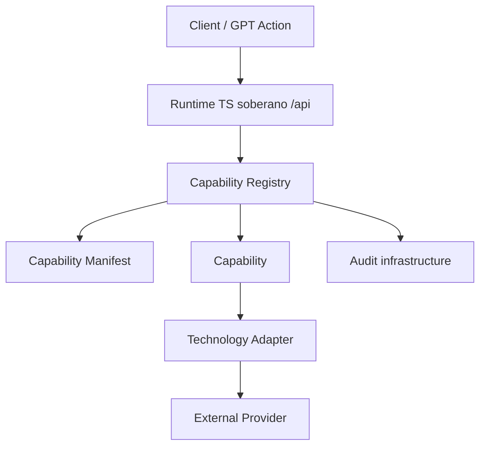

# LUNA Gateway Architecture

The LUNA Gateway is the sovereign API organ that exposes organism capabilities in a standardized, safe, and auditable form. It contains no cognition, planner, autonomy, or AI. Every execution enters through the Capability Registry.

## Registry

The registry owns discovery and execution routing. Capabilities are registered once with an id and version. Discovery responses are generated from registered manifests, never manually assembled.

## Contracts

All capabilities use the same `CapabilityRequest` and `CapabilityResult` contracts. This keeps future capabilities compatible with the same gateway lifecycle, audit shape, dry-run behavior, health states, and evidence model.

## Capability lifecycle

1. `capability.requested` audit event is emitted.
2. Registry resolves the requested capability id and version.
3. Disabled capabilities return a standardized failed result.
4. Capability executes or dry-runs.
5. `capability.executed` or `capability.failed` is emitted.

## Adapters

Capabilities never call external technologies directly. `github.read_file` uses the GitHub adapter, and the adapter is the single boundary for GitHub REST details.

## Manifest and health

Each capability has a dedicated manifest with id, version, owner, health, approval, dry-run, rollback, and description metadata. Valid health states are `healthy`, `degraded`, and `disabled`.

## Discovery

`GET /api/gateway/capabilities` returns the registry discovery list. Adding future capabilities requires registration, not manual response edits.
