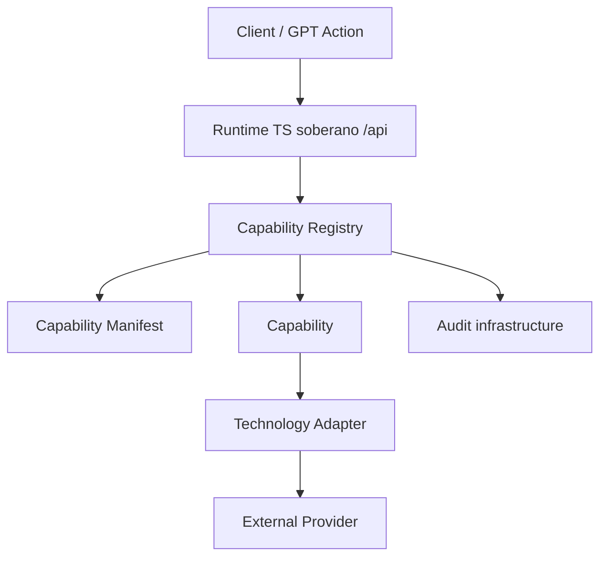

# LUNA Gateway Architecture

The LUNA Gateway is the sovereign API organ that exposes organism capabilities in a standardized, safe, and auditable form. It contains no cognition, planner, autonomy, or AI. Every execution enters through the Capability Registry.

## Registry

The registry owns discovery and execution routing. Capabilities are registered once with an id and version. Discovery responses are generated from registered manifests, never manually assembled.

## Contracts

All capabilities use the same `CapabilityRequest` and `CapabilityResult` contracts. This keeps future capabilities compatible with the same gateway lifecycle, audit shape, dry-run behavior, health states, and evidence model.

## Capability lifecycle

1. `capability.requested` audit event is emitted.
2. Registry resolves the requested capability id and version.
3. Disabled capabilities return a standardized failed result.
4. Capability executes or dry-runs.
5. `capability.executed` or `capability.failed` is emitted.

## Adapters

Capabilities never call external technologies directly. All GitHub capabilities share the `GithubAdapter` contract, implemented exclusively by `GithubRestAdapter` — the single boundary for GitHub REST/Git Data API details. All filesystem capabilities share the `FilesystemAdapter` contract, implemented exclusively by `FilesystemRestAdapter` — the single boundary for local filesystem access, sandboxed to an adapter root directory (path traversal outside the root is rejected).

## Manifest and health

Each capability has a dedicated manifest with id, version, owner, health, approval, dry-run, rollback, and description metadata. Valid health states are `healthy`, `degraded`, and `disabled`.

## Rollback

`supportsRollback` on the manifest declares whether a capability's effect can be reversed. Capabilities that support it additionally implement the additive `RollbackableCapability` interface (`rollback(output, context)`), which is not part of the base `Capability` contract so read-only and non-reversible capabilities are unaffected. `isRollbackableCapability()` narrows a `Capability` to check for this at runtime. Rollback reuses the same `CapabilityResult` contract as `execute()`.

## Capability packs

### GitHub pack (`GithubRestAdapter`)

| Capability | Rollback |
| --- | --- |
| `github.read_file` | n/a (read-only) |
| `github.write_file` | restores previous file content, or deletes the file if it was newly created |
| `github.create_branch` | deletes the created branch |
| `github.commit` | not applicable — git history is immutable; reverting requires a new commit |
| `github.create_pull_request` | closes the pull request |
| `github.list_branches` | n/a (read-only) |
| `github.list_pull_requests` | n/a (read-only) |
| `github.list_commits` | n/a (read-only) |
| `github.compare_commits` | n/a (read-only) |
| `github.create_issue` | closes the issue |
| `github.comment_pull_request` | deletes the comment |

### Filesystem pack (`FilesystemRestAdapter`)

| Capability | Rollback |
| --- | --- |
| `filesystem.read` | n/a (read-only) |
| `filesystem.write` | restores previous file content, or deletes the file if it was newly created |
| `filesystem.list` | n/a (read-only) |
| `filesystem.search` | n/a (read-only) |
| `filesystem.diff` | n/a (read-only) |
| `filesystem.exists` | n/a (read-only) |

## Discovery

`GET /api/gateway/capabilities` returns the registry discovery list. Adding future capabilities requires registration, not manual response edits.
