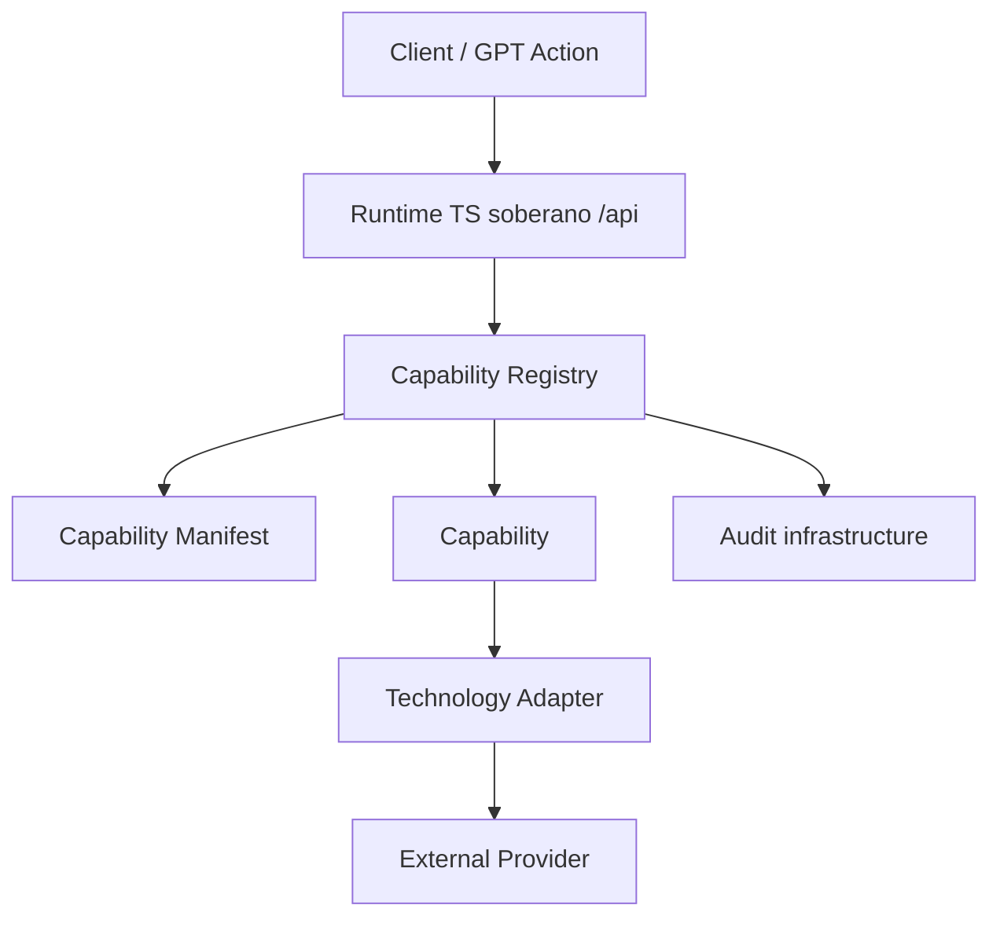

# LUNA Gateway Architecture

The LUNA Gateway is the sovereign API organ that exposes organism capabilities in a standardized, safe, and auditable form. It contains no cognition, planner, autonomy, or AI. Every execution enters through the Capability Registry.

## Registry

The registry owns discovery and execution routing. Capabilities are registered once with an id and version. Discovery responses are generated from registered manifests, never manually assembled.

## Contracts

All capabilities use the same `CapabilityRequest` and `CapabilityResult` contracts. This keeps future capabilities compatible with the same gateway lifecycle, audit shape, dry-run behavior, health states, and evidence model.

## Capability lifecycle

1. `capability.requested` audit event is emitted.
2. Registry resolves the requested capability id and version.
3. Disabled capabilities return a standardized failed result.
4. Capability executes or dry-runs.
5. `capability.executed` or `capability.failed` is emitted.

## Adapters

Capabilities never call external technologies directly. All GitHub capabilities share the `GithubAdapter` contract, implemented exclusively by `GithubRestAdapter` — the single boundary for GitHub REST/Git Data API details. All filesystem capabilities share the `FilesystemAdapter` contract, implemented exclusively by `FilesystemRestAdapter` — the single boundary for local filesystem access, sandboxed to an adapter root directory (path traversal outside the root is rejected).

## Manifest and health

Each capability has a dedicated manifest with id, version, owner, health, approval, dry-run, rollback, and description metadata. Valid health states are `healthy`, `degraded`, and `disabled`.

## Rollback

`supportsRollback` on the manifest declares whether a capability's effect can be reversed. Capabilities that support it additionally implement the additive `RollbackableCapability` interface (`rollback(output, context)`), which is not part of the base `Capability` contract so read-only and non-reversible capabilities are unaffected. `isRollbackableCapability()` narrows a `Capability` to check for this at runtime. Rollback reuses the same `CapabilityResult` contract as `execute()`.

## Capability packs

### GitHub pack (`GithubRestAdapter`)

| Capability | Rollback |
| --- | --- |
| `github.read_file` | n/a (read-only) |
| `github.write_file` | restores previous file content, or deletes the file if it was newly created |
| `github.create_branch` | deletes the created branch |
| `github.commit` | not applicable — git history is immutable; reverting requires a new commit |
| `github.create_pull_request` | closes the pull request |
| `github.list_branches` | n/a (read-only) |
| `github.list_pull_requests` | n/a (read-only) |
| `github.list_commits` | n/a (read-only) |
| `github.compare_commits` | n/a (read-only) |
| `github.create_issue` | closes the issue |
| `github.comment_pull_request` | deletes the comment |

### Filesystem pack (`FilesystemRestAdapter`)

| Capability | Rollback |
| --- | --- |
| `filesystem.read` | n/a (read-only) |
| `filesystem.write` | restores previous file content, or deletes the file if it was newly created |
| `filesystem.list` | n/a (read-only) |
| `filesystem.search` | n/a (read-only) |
| `filesystem.diff` | n/a (read-only) |
| `filesystem.exists` | n/a (read-only) |

## Discovery

`GET /api/gateway/capabilities` returns the registry discovery list. Adding future capabilities requires registration, not manual response edits.

## Capability packs

The gateway currently expands three technology surfaces, each behind its own dedicated adapter. No capability calls an external SDK, API, or the filesystem directly — every call passes through the pack's adapter.

- **Supabase** (`supabase.query`, `supabase.insert`, `supabase.update`, `supabase.delete`, `supabase.rpc`, `supabase.upload_file`, `supabase.download_file`) — `SupabaseRestAdapter` (`src/gateway/adapters/supabase-adapter.ts`) is the only module that imports `@supabase/supabase-js`.
- **Railway** (`railway.deploy`, `railway.list_services`, `railway.status`, `railway.logs`, `railway.variables`, `railway.restart_service`) — `RailwayGraphqlAdapter` (`src/gateway/adapters/railway-adapter.ts`) is the only module that talks to the Railway public GraphQL API.
- **Reporter** (`reporter.audit_repository`, `reporter.snapshot`, `reporter.runtime_state`, `reporter.repository_map`, `reporter.capability_inventory`, `reporter.architecture_report`) — `ReporterFsAdapter` (`src/gateway/adapters/reporter-adapter.ts`) is the only module that reads the filesystem, git, and the registry's discovery list. Reporter capabilities are exclusively observational: none of them mutate state, and none require approval.

Every capability delegates its dry-run/approval/timing/error-shaping lifecycle to the shared `runCapabilityLifecycle` helper (`src/gateway/capabilities/lifecycle.ts`), so the behavior described below is identical across all packs.

## Approval

Manifests with `requiresApproval: true` (all destructive Supabase and Railway capabilities: insert, update, delete, rpc, upload_file, deploy, restart_service) only execute when the caller sends `approval: true` in `context.metadata`. Without it, the capability short-circuits with an `APPROVAL_REQUIRED` error and the adapter is never invoked. Dry-run requests always short-circuit before the approval check, so a dry-run never requires approval.

## Audit

Every capability execution is recorded through `GatewayAuditor`: a `capability.requested` event captures the start and caller (`context.actor`), a `capability.dryrun` event is added when `dryRun` is set, and a `capability.executed`/`capability.failed` event captures the end, duration, evidence, and error alongside the same caller context.

## Context Sync

`reporter.snapshot` is the seam between the gateway and the organism's longitudinal memory. It calls `RepositoryContextSync` (`src/gateway/context/context-sync.ts`), which implements the pre-existing `ContextSyncPort`/`ContextSyncCheckpoint` contracts, to persist a checkpoint referencing:

- Cognitive Index — `luna_core`
- Checkpoints — `luna_checkpoint.json`, `docs/checkpoints/LUNA_LONGITUDINAL_MEMORY.md`
- Runtime Memory — `.luna/runtime/runtime_state.json`
- Architectural Memory — `luna_context/ARCHITECTURE.md`, `docs/architecture/luna-gateway.md`

Checkpoints are appended to `.luna/runtime/context_sync_checkpoints.json`, alongside the organism's existing runtime observability files. No new memory model or sync architecture was introduced; only the existing contract was implemented.

## OpenAPI

`GET /gateway/capabilities` and `POST /gateway/execute` are generic over `CapabilityManifest`, `CapabilityRequest`, and `CapabilityResult`. Because every new capability reuses those same shapes, the OpenAPI spec, `api-zod`, and `api-client-react` already cover the Supabase, Railway, and Reporter packs without any schema changes.
